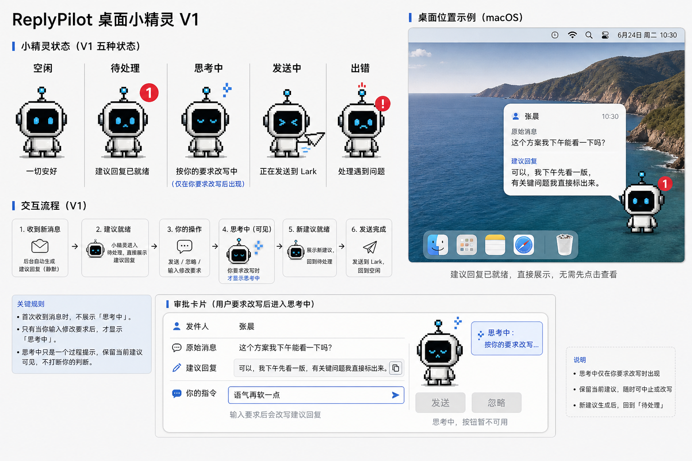

# ReplyPilot Desktop Pet Design

日期：2026-06-24

状态：设计规格草案，等待用户审阅后再进入 implementation plan。

## 目标

ReplyPilot 从“飞书 bot 里审批回复”改为“桌面小精灵提醒并协助处理飞书消息”。

V1 的用户心智是：桌面上常驻一个像素风小精灵。飞书有人发消息后，后台先静默生成建议回复；建议回复准备好后，小精灵直接展示“谁发了什么 + 建议怎么回”。我可以点快捷按钮，也可以直接告诉它“怎么改”。当我主动要求改写时，小精灵再进入“思考中”，表示它正在按我的要求重新生成建议。第一版先用规则识别“发送 / 忽略 / 改写”，未来再把这层替换成面向 agent 的处理接口。

## 当前依据

当前仓库已经有以下能力：

- `PersonalWatchService` 负责轮询监听、消息合并、上下文加载、摘要生成、草稿生成、过期处理和最终发送。
- `SqliteApprovalStore` 已有 `approval_requests`、`execution_logs`、`watch_watermarks` 三类持久化数据。
- `watch` 当前同时做两件事：轮询目标飞书会话，以及监听发给 bot 的确认命令。
- 现有主问题不在草稿生成能力，而在审批入口仍发生在飞书 IM 内。

## 非目标

V1 不做完整聊天客户端。

V1 不替代飞书，也不读取所有飞书消息，只处理配置过的监听对象或会话。

V1 不自动发送未确认的 AI 回复。用户自然语言指令可以触发改写、忽略、准备发送，但真实写回飞书必须有明确发送动作。

V1 不把浏览器本地控制台作为主入口。

V1 不把飞书 bot 卡片作为主入口。旧飞书 bot 命令可以保留为 fallback。

## 产品形态

### 桌面小精灵

桌面上常驻一个像素风小精灵。它是主入口，不是菜单栏应用。

视觉参考：



V1 小精灵长相先固定为一个简单像素机器人：

- 48x48 px 风格的方形小机器人。
- 黑色屏幕脸，蓝色像素眼睛。
- 白色或浅灰机身，蓝色点缀。
- 头顶一个小天线或状态灯。
- 不做复杂角色设定，不做动物拟态，不绑定飞书品牌。
- 目标是“桌面助手状态表达”，不是装饰性桌宠。

小精灵能力：

- 可拖拽到任意屏幕位置。
- 记住最后位置。
- 支持固定到角落：左上、右上、左下、右下。
- 支持置顶。
- 支持空闲、待处理、思考中、发送中、出错五种核心视觉状态。
- 右键或设置按钮进入配置。

菜单栏最多作为兜底入口，用于重新显示小精灵、退出应用、打开设置，不承载日常审批。

### 视觉状态

V1 定义五个用户可见状态。其中“思考中”只用于用户主动要求改写后的等待反馈，不用于首次收到消息后的后台草稿生成。

| 状态 | 触发条件 | 小精灵表现 | 用户能做什么 |
| --- | --- | --- | --- |
| 空闲 | watcher 正常运行，暂无待处理消息 | 放松站立，普通眼睛，无角标 | 可拖拽、打开设置 |
| 待处理 | 已生成 pending request | 眼睛警觉，红色数字角标，如 `1` | 可展开审批卡片 |
| 思考中 | 用户输入改写要求，系统正在重新生成建议 | 思考点、轻微忙碌姿态 | 等待新建议，保留原建议可见 |
| 发送中 | 用户确认发送，正在写回飞书 | 纸飞机或运动线 | 等待结果，避免重复点击 |
| 出错 | 生成、鉴权或发送失败 | 红色警告标记，表情变紧张 | 查看错误、重试、忽略 |

后台仍然会经历“消息发现、上下文整理、首次草稿生成”，但这个过程不作为桌宠状态展示。只有建议回复已经生成后，用户才被打扰。

“首次生成”和“用户触发改写”的状态区别必须清楚：

- 首次生成：静默完成，不显示“思考中”。用户看到的是已经准备好的建议回复。
- 用户触发改写：显示“思考中”。因为此时用户已经在交互里，需要知道系统正在处理他的要求。

### 消息提醒

当建议回复生成后，小精灵进入“待处理”。它旁边直接出现带内容的审批气泡，不再先显示“点击处理”的空提醒。

```text
张晨：
这个方案我下午能看一下吗？

建议回复：
可以，我下午先看一版，有关键问题我直接标出来。
```

这层气泡已经包含原消息和建议回复。用户不需要为了看建议再点一次。

### 审批卡片

审批气泡可以直接处理。如果空间不足，可以点击小精灵或气泡展开为更完整的审批卡片。

审批卡片贴着小精灵出现，不是完整应用窗口。它像一个桌面气泡面板，包含消息来源、原消息、建议回复、指令输入和操作按钮。

卡片包含：

- 发送人或群名。
- 原消息。
- 建议回复。
- 可选上下文摘要。第一版可以折叠或放在详情区，避免卡片过重。
- 指令输入框，placeholder 为 `告诉我怎么处理...`。
- 快捷动作：发送、忽略。
- 建议回复旁提供复制按钮，方便人工兜底。

卡片示例：

```text
发件人：张晨
原始消息：这个方案我下午能看一下吗？
建议回复：可以，我下午先看一版，有关键问题我直接标出来。

[告诉我怎么处理...                    >]
我会按你的要求改写，再让你确认

[发送] [忽略]
```

用户可以在输入框里写：

- `语气软一点`
- `帮我回他，下午可以，但别承诺今天给结论`
- `先问他要哪个版本的方案`
- `就这么发`
- `这个先不用回`

## 核心交互

### 默认流程

1. `watch` 轮询飞书目标联系人或会话。
2. 发现新消息后，按现有 quiet window 合并连续消息。
3. 加载上下文，生成上下文摘要。
4. 生成建议回复。
5. 写入 SQLite 的 pending request。
6. 桌面小精灵收到待处理事件，进入待处理状态，并直接展示带原消息和建议回复的审批气泡。
7. 用户可以直接在气泡中处理，也可以展开完整审批卡片。
8. 用户选择发送、忽略，或输入处理指令。
9. V1 用规则解释处理指令：明确发送则发送，明确忽略则忽略，其余非空输入都作为改写要求。
10. 当输入被解释为改写要求时，小精灵进入思考中，并保留原建议可见。
11. 新回复生成后，小精灵回到待处理状态，展示新建议。
12. 用户确认发送后，系统用飞书 user 身份回复原消息。

### 指令处理

指令输入框不是自由执行命令，也不是 V1 的通用 agent。它是审批器里的处理入口。

V1 先用规则解释器，不引入 agent 决策：

- 命中发送短语：等同点击发送。示例：`发吧`、`发送`、`就这么发`、`可以发`。
- 命中忽略短语：等同点击忽略。示例：`忽略`、`不用回`、`先不回`、`这个先不用回`。
- 其余非空输入：一律作为改写要求，交给现有 agent channel 重新生成回复。示例：`语气软一点`、`别承诺今天给结论`、`先问他要哪个版本的方案`。

V1 不要求 agent 理解用户意图，也不让 agent 决定是否发送。agent 只负责基于“原消息 + 上下文 + 当前草稿 + 改写要求”生成新回复。

未来如果桌面小精灵要同时接 Codex、Claude Code 或其他系统，可以把规则解释器替换成 `ActionAgent`，但 UI 层仍然只面向统一的审批接口。

### 多消息与过期

同一个会话在等待审批期间又来了新消息，旧 request 进入 `SUPERSEDED`。

桌面小精灵不再展示旧 request 的发送按钮，只提示：

```text
这条建议已过期，对方又发了新消息。
```

新 request 生成后进入队列首位。

## 状态机

### Request 状态

沿用现有 `STATUS`，但收敛实际语义。

```text
RECEIVED
  -> DRAFT_FAILED
  -> PENDING_APPROVAL

PENDING_APPROVAL
  -> SENT
  -> IGNORED
  -> SUPERSEDED
  -> DRAFT_FAILED

PENDING_APPROVAL + rewrite instruction
  -> PENDING_APPROVAL
```

现有 `DRAFTED`、`APPROVED`、`REJECTED`、`REWRITE_REQUIRED`、`DIRECTION_REQUIRED`、`MEETING_REQUESTED`、`SEND_FAILED` 暂不作为 V1 桌宠主链路状态。它们可以保留在枚举中，但桌面端只依赖上面这组实际状态。

发送失败时应进入 `SEND_FAILED`，并保留原 request，不自动忽略。

### 桌宠视觉状态

桌宠视觉状态不等于 request 状态。它是 UI 聚合态，V1 保留五种：

- `idle`：对应视觉文案“空闲”。
- `pending`：对应视觉文案“待处理”。
- `thinking`：对应视觉文案“思考中”，仅用于用户主动要求改写后的重新生成过程。
- `sending`：对应视觉文案“发送中”。
- `error`：对应视觉文案“出错”。

当有多个 pending request 时，视觉状态仍为 `pending`，用数字角标展示数量。

## 审批器边界

新增两个审批器概念：`ApprovalSurface` 和 `ApprovalController`。

`ApprovalSurface` 负责把后台生成的 pending request 呈现给用户。

建议接口：

```ts
type ApprovalSurface = {
  notifyPending(request: ApprovalRequest): Promise<ApprovalNotificationResult>;
  notifyExpired(requestId: string): Promise<void>;
};
```

V1 可以有两个实现：

- `DesktopPetApprovalSurface`：主实现，写入本地事件通道，驱动桌面小精灵提醒。
- `LarkBotApprovalSurface`：fallback，沿用当前飞书 bot Markdown 和文本命令。

`PersonalWatchService` 不应直接知道“发飞书 Markdown 通知自己”。它只知道“有一个 pending request 需要交给 approval surface”。

`ApprovalController` 负责处理用户动作。桌宠和飞书 bot fallback 都调用它，避免各自实现发送、忽略、改写和过期校验。

建议接口：

```ts
type ApprovalController = {
  listPending(): Promise<ApprovalRequest[]>;
  getRequest(requestId: string): Promise<ApprovalRequest | undefined>;
  send(requestId: string, actor: "desktop-pet" | "lark-bot"): Promise<ApprovalRequest>;
  ignore(requestId: string, actor: "desktop-pet" | "lark-bot"): Promise<ApprovalRequest>;
  handleInstruction(input: {
    requestId: string;
    instruction: string;
    actor: "desktop-pet" | "lark-bot";
  }): Promise<ApprovalInstructionResult>;
};
```

当前 `handleConfirmationText` 的发送、忽略、改写逻辑后续应迁移或委托给 `ApprovalController`。

V1 的 `handleInstruction` 使用规则解释器：

```text
send phrases -> send(requestId)
ignore phrases -> ignore(requestId)
otherwise -> rewrite(requestId, instruction)
```

后续如果需要接 agent，不改变桌宠 UI，只替换 `handleInstruction` 后面的解释器实现。

## 审批器配置

审批器配置分三层：

- `approval.primarySurface`: V1 默认为 `desktop-pet`。
- `approval.fallbackLarkBot`: V1 默认为 `true`，保留旧 bot 命令。
- `approval.instructionMode`: V1 默认为 `rules`，未来可扩展为 `agent`。
- `approval.allowDirectSendByInstruction`: V1 默认为 `true`。用户明确说“发吧”“就这么发”时，等同点击发送。

如果 `allowDirectSendByInstruction=false`，输入框永远只生成或改写草稿，最终必须点击发送按钮。

## 存储设计

### 继续保留 SQLite 为状态中心

SQLite 仍是后台 watcher 和桌面小精灵之间的事实来源。

继续使用：

- `approval_requests`：保存每个待处理请求的完整 JSON。
- `execution_logs`：保存状态变化、生成、改写、发送、失败等事件。
- `watch_watermarks`：保存每个监听对象的水位。

### ApprovalRequest 字段

V1 request JSON 建议明确以下字段：

```json
{
  "id": "req_xxx",
  "eventId": "req_xxx",
  "source": "personal-watch",
  "senderId": "ou_xxx",
  "senderName": "张晨",
  "chatId": "ou_xxx 或 oc_xxx",
  "messageId": "om_xxx",
  "text": "原消息",
  "contextSummary": "上下文摘要",
  "draftText": "建议回复",
  "status": "PENDING_APPROVAL",
  "channel": "hermes 或 ollama",
  "createdAt": "ISO time",
  "updatedAt": "ISO time",
  "approvalSurface": "desktop-pet",
  "rewriteInstruction": "最近一次用户指令",
  "supersededByMessageId": "om_new",
  "sentMessageId": "om_reply",
  "errorMessage": "失败原因"
}
```

现有表结构是 JSON 存储，V1 可以先扩展 JSON 字段，不需要立即做关系表迁移。

### 桌宠配置

桌宠配置不放进 `approval_requests`。

建议新增一份本地配置，优先写入 `.reply-pilot/desktop.json`：

```json
{
  "enabled": true,
  "theme": "pixel",
  "position": {
    "mode": "free",
    "x": 1320,
    "y": 820,
    "corner": "bottom-right"
  },
  "alwaysOnTop": true,
  "scale": 1,
  "doNotDisturb": false,
  "showSystemNotification": true,
  "fallbackLarkBot": true,
  "approval": {
    "instructionMode": "rules",
    "allowDirectSendByInstruction": true
  }
}
```

原因：位置、主题、置顶、免打扰是桌面 UI 偏好，不是审批业务数据。与 `.reply-pilot/config.json` 分开可以减少对现有 runtime config 的影响。

## 技术形态

### 推荐方案：Tauri 桌宠壳 + Node watcher

Tauri 负责：

- 透明无边框窗口。
- 桌宠渲染与拖拽。
- 桌面位置记忆。
- 审批卡片。
- 系统通知。
- 与本地后端通信。

Node watcher 负责：

- 飞书消息轮询。
- 上下文加载。
- agent channel 调用。
- SQLite request 和日志写入。
- 飞书 user 身份发送回复。

两者通过本地 IPC 或本地 HTTP/WebSocket 通信。V1 应优先选一种实现，不同时维护两条通道。

### 备选方案

备选一：Electron 桌宠壳。

优点是桌宠类项目样例多，Node 集成直接。缺点是体积重，不符合当前偏好。

备选二：SwiftUI 原生 macOS 桌宠壳 + Node watcher。

优点是桌面体验更原生。缺点是引入 Swift/macOS 专属工程，对当前 JS 项目协作成本更高。

## 进程与启动边界

V1 可以先保留 `npm start` 启动 watcher。

桌宠应用启动后应负责检查 watcher 是否运行：

- 如果 watcher 未运行，提示“后台监听未启动”，并提供启动入口。
- 如果 watcher 运行中，显示 `idle` 或当前 pending 状态。

后续可以把 watcher 作为 sidecar 或子进程交给桌宠应用管理，但 V1 规格不强制。

## 安全与确认

真实发送必须满足：

- request 仍是 `PENDING_APPROVAL`。
- request 未被新消息 `SUPERSEDED`。
- 用户执行了明确发送动作。
- 发送使用幂等 key。
- 发送后回写 `sentMessageId` 和 `SENT` 状态。

输入框指令默认不能绕过最终确认，除非用户明确说“发吧”“就这么发”，且 `approval.allowDirectSendByInstruction=true`。即便如此，服务层也要复查 request 状态。

## 错误处理

生成失败：

- request 进入 `DRAFT_FAILED`。
- 桌宠进入 `error`。
- 展示失败原因摘要。

发送失败：

- request 进入 `SEND_FAILED`。
- 保留草稿和原消息。
- 用户可以重试、改写或忽略。

鉴权失败：

- 桌宠展示“飞书鉴权不可用”。
- 不允许发送。
- 引导用户运行或检查 auth-check，但不能把 dry-run 当成真实完成。

watcher 离线：

- 桌宠显示后台未运行。
- 不展示“监听中”。

## 验收口径

本地验证：

- 桌宠可显示、拖拽、记住位置。
- pending request 可从 SQLite 展示到审批卡片。
- 点击发送、改写、忽略会更新 SQLite 状态。

集成验证：

- 真实飞书消息进入监听对象后，产生 pending request。
- 桌宠在建议回复生成后进入待处理状态，并直接展示原消息和建议回复。
- 用户输入改写要求后，桌宠进入思考中；新草稿生成后回到待处理。
- 用户确认发送后，飞书原消息收到真实回复。
- 新消息到达时旧 request 被标记为 `SUPERSEDED`，桌宠不可发送旧草稿。

验收表述必须区分 dry-run、本地 UI 验证、真实飞书回写和远端回读。

## 待用户继续拍板

以下不是实现阻塞，但会影响第一版体验：

- 技术壳：优先 Tauri，还是接受 Electron 的工程重量换更快桌宠样例复用。
- 启动方式：V1 是否由桌宠应用托管 watcher，还是先保留手动启动 `npm start`。
- 第一版资产：按当前概念图做简单像素机器人，并先提供五个状态帧：空闲、待处理、思考中、发送中、出错。其中思考中只用于用户触发改写后的等待状态。
